<p align="center">
  
</p>

# onevoice-meet

> Self-hostable, end-to-end video conferencing platform for up to 50 participants per room — with audio/video/screenshare, virtual backgrounds, moderator controls, server-side recording, multi-destination livestreaming, in-meeting playback, polls, Q&A, whiteboard, chat with reactions, automatic transcription, and a manual YouTube publish flow.

**Reference deployment:** [`meet.witysk.org`](https://meet.witysk.org), running on a Hetzner host that also hosts the `coturn` server used by the companion app [`one.witysk.org`](https://one.witysk.org). The reference deployment is what the configuration examples in this repo assume — but every piece is configurable, and the documentation calls out exactly which knobs to turn to swap in your own hostnames, TURN server, and SSO issuer.

---

## Table of contents

- [What's in the box](#whats-in-the-box)
- [Screenshots & promo](#screenshots--promo)
- [Quick start (local dev)](#quick-start-local-dev)
- [Architecture at a glance](#architecture-at-a-glance)
- [Documentation](#documentation)
- [Status](#status)
- [License](#license)

---

## What's in the box

A complete meeting platform you can host yourself. The stack is small enough to fit on a 2-vCPU box and large enough to run real meetings end-to-end.

### Real-time media
- **WebRTC SFU** — LiveKit Server. Up to 50 participants per room. Opus / VP8 / VP9 / H.264 / AV1.
- **TURN fallback** — Reuses an existing `coturn` deployment (works behind aggressive NATs and corporate firewalls).
- **Virtual backgrounds** — Blur and image replacement via MediaPipe (`@livekit/track-processors`).
- **Audio enhancements** — Per-tab output volume, mono-audio (accessibility), push-to-talk.
- **Screen sharing & multi-tile grid** — Standard LiveKit grid; auto-spotlight on the active speaker.
- **Picture-in-picture egress layout** — Custom Web template for recordings and livestreams that puts the main source full-bleed and overlays a corner camera.

### Meeting features
- **Lobby / waiting room** — Optional password gate, optional name requirement, optional waiting room with admit / deny.
- **Moderation** — Mute, kick, lower-hand, pin presenter, lock room after start, ban participant chat or screenshare. Co-host promotion.
- **Hand raise, emoji reactions, push-to-talk** — Real-time, all wired through LiveKit data channels.
- **Chat with reactions, replies, image attachments, pinned messages** — Persisted server-side so late joiners see history.
- **Polls + Q&A** — Live polls (2–6 options), upvoted question queue, "mark answered" by host.
- **Shared notes + whiteboard** — Free-draw strokes, persistent shapes (rect/ellipse/text), replayable for late joiners.
- **Recurring meetings** — RFC 5545 iCalendar export (`.ics`) with RRULE.
- **Discoverable meetings** — Optional public landing-page listing; optional listing for any signed-in user; per-meeting opt-in.
- **View-only public stream** — Embeddable read-only viewer at `/public/<slug>` for any meeting.
- **Always-on "TI Café"** — Persistent audio-only social room.

### Recording
- **Composite room recording** — LiveKit Egress with H.264 720p30 + AAC (1080p toggle available). Stored locally; configurable retention (default 30 days).
- **Disk-cap GC** — When the recordings filesystem hits a configured fraction of capacity, the oldest completed recordings are deleted first.
- **Multiple layouts** — Speaker, grid, single-speaker, or the custom PiP template.
- **Automatic transcription** — Self-hosted `whisper.cpp` (ggml-base.en) transcribes every completed recording. Transcript emailed to captured participant addresses; viewable + downloadable from the recordings page.
- **Manual YouTube publish** — One-click upload to a connected YouTube channel via OAuth2 desktop flow; choose public / unlisted / private per recording.

### Livestreaming
- **Multi-destination simulcast** — Push the same composite to **X (Twitter)**, **YouTube Live**, **Substack**, **Facebook Live**, and **Rumble** simultaneously over RTMPS.
- **Per-destination status** — Each platform reports back over the LiveKit `egress_updated` webhook; the in-meeting UI shows which destinations are streaming and which have failed with the egress's own error string.
- **Independent recording toggle** — Record off but stream on, or vice versa, without restarting the room.

### In-meeting video playback
- **Playlist of MP4s** — Host uploads videos into a meeting's playlist before / during the meeting.
- **One-click play** — The host clicks Play; LiveKit Ingress (`URL_INPUT`) pulls the MP4 from the meeting-api and republishes it as a participant track every viewer sees.
- **Pause, resume, reorder, loop** — Pause freezes a single-frame stream so every viewer sees the same image; resume rebuilds the ingress at the right offset. Aliases let the same MP4 sit at multiple positions without duplicating bytes.
- **"What's up next" rundown slide** — When enabled, a 35-second broadcast-style slide with the meeting name, accent colours, and a countdown of the next 5 items auto-plays before any item over 5 minutes (manual advance, auto-advance, or loop wrap — all eligible). The slide is a transient MP4 generated on the fly and cached by content hash.

### Identity & billing
- **Dual auth** — Native email + password accounts (Argon2-hashed), or SSO from a companion `one.witysk.org` issuer via a tiny localStorage→postMessage bootstrap iframe (HS256 shared secret, no JWKS needed).
- **TOTP & email-OTP 2FA** — Native users only. RFC 6238 TOTP plus single-use recovery codes; or a 6-digit email code with a 5-minute Redis-backed TTL.
- **10-day free trial** — Every native account gets one trial automatically.
- **PayPal billing** — Monthly subscription (auto-renew), one-shot monthly (bill-once), or one-shot annual. Live webhook reconciliation; works in sandbox and live.
- **Vouchers** — Privileged users can issue short single-use codes that grant a configurable entitlement window (default 30 days). HMAC-signed to prevent forgery.
- **Per-user privacy preferences** — Anonymise email in join log, suppress IP logging, prefer mono audio, blur real names in chat (privacy mode).

### Operations
- **Intrusion detection (IDS)** — In-memory sliding-window detector for auth brute-force, 2FA brute-force, and path scanning; auto-temp-blocks offending IPs.
- **Persistent IP blocklist** — Exact IP / CIDR / dash-range entries managed from the admin panel. O(1) middleware check.
- **Platform admin panel** — User management (disable / promote / force-reset / delete), IP blocklist editor, IDS live view.
- **Three rotating log files** — `app.log`, `requests.log`, `db.log` — daily, gzipped, 180-day retention.
- **Health probe** + `/api/openapi.json` for monitoring.
- **i18n** — UI strings in i18next; helper scripts to find untranslated keys.

---

## Screenshots & promo

The header SVG is the promo image used on social channels for the reference deployment. A PNG export sits alongside it (`tweet-promo.png`) for platforms that don't render SVG (Twitter, LinkedIn cards, etc.).

---

## Quick start (local dev)

```bash
# 1. Configure secrets.
cp .env.example .env

# 2. Generate LiveKit keys and paste them into .env.
docker run --rm livekit/livekit-server generate-keys

# 3. (Optional) If integrating with one.witysk.org's SSO, set JWT_SECRET_KEY
#    to match its SECRET_KEY. Otherwise pick any long random string and use
#    native signup at /signup.

# 4. Boot everything.
docker compose up -d

# 5. Visit http://localhost — Caddy serves the SPA and proxies the API.
```

Default ports:

| Port  | Service                                    |
| ----- | ------------------------------------------ |
| 80/443 | Caddy (HTTP + TLS, fronts everything)     |
| 8080  | `meeting-api` (loopback only)              |
| 7880  | LiveKit signaling (host network)           |
| 7881  | LiveKit ICE/TCP                            |
| 50000–60000/udp | LiveKit WebRTC media              |
| 6379  | Redis (loopback only)                      |

For a real TLS certificate, point DNS at the host and make sure port 80 is reachable from the public internet — Caddy provisions a Let's Encrypt cert on first boot.

See **[docs/DEVELOPMENT.md](docs/DEVELOPMENT.md)** for running the frontend / API standalone with hot reload.

---

## Architecture at a glance

```
                                       ┌──────────────────────────────┐
                          users ───────┤  Caddy 2  (TLS, reverse proxy) │
                                       └──────────────────────────────┘
                                          │       │      │       │
                              ┌───────────┘       │      │       └────────────┐
                              ▼                   ▼      ▼                    ▼
                     ┌─────────────────┐  ┌────────────────┐  ┌────────────────────┐
                     │  React SPA      │  │  meeting-api   │  │  LiveKit signaling │
                     │  (Vite build)   │  │  (FastAPI)     │  │  (network_mode:host)│
                     └─────────────────┘  └────────────────┘  └────────────────────┘
                                                  │                   │
                                                  │                   │
                                  ┌───────────────┼───────────────────┤
                                  ▼               ▼                   ▼
                       ┌─────────────┐  ┌─────────────┐    ┌─────────────────────┐
                       │   SQLite    │  │   Redis     │    │ LiveKit Egress      │
                       │  /var/lib/  │  │  (sessions, │    │ (record + stream)   │
                       │   meet.db   │  │   ratelim)  │    └─────────────────────┘
                       └─────────────┘  └─────────────┘
                                                            ┌─────────────────────┐
                                                            │ LiveKit Ingress     │
                                                            │ (video playback)    │
                                                            └─────────────────────┘
                                                            ┌─────────────────────┐
                                                            │ Compositor          │
                                                            │ (Puppeteer+Chrome)  │
                                                            └─────────────────────┘
                                                            ┌─────────────────────┐
                                                            │ Whisper.cpp         │
                                                            │ (transcription)     │
                                                            └─────────────────────┘
                                                                      │
                                                                      ▼
                                                            ┌──────────────────────┐
                                                            │ coturn  (turn server)│
                                                            │ NOT in this compose; │
                                                            │ runs on the host.    │
                                                            └──────────────────────┘
```

Full diagram and traffic flow in **[docs/ARCHITECTURE.md](docs/ARCHITECTURE.md)**.

---

## Documentation

| File                                                | Audience                                          |
| --------------------------------------------------- | ------------------------------------------------- |
| [docs/ARCHITECTURE.md](docs/ARCHITECTURE.md)         | How the services fit together. Read this first.   |
| [docs/FEATURES.md](docs/FEATURES.md)                 | Full functional catalog, page by page.            |
| [docs/API.md](docs/API.md)                           | REST endpoints, auth, request/response shapes.    |
| [docs/CONFIGURATION.md](docs/CONFIGURATION.md)       | Every `.env` variable explained.                  |
| [docs/DEVELOPMENT.md](docs/DEVELOPMENT.md)           | Local dev loop, tests, building the frontend.     |
| [docs/SECURITY.md](docs/SECURITY.md)                 | Auth, CSP, rate limits, IDS, data retention.      |
| [DEPLOYMENT.md](DEPLOYMENT.md)                       | Production deployment (reference: Hetzner box).   |
| [CONTRIBUTING.md](CONTRIBUTING.md)                   | How to propose changes.                           |
| [one-witysk-integration/](one-witysk-integration/)   | One-page SSO bridge for the companion app.        |
| [meeting-api/README.md](meeting-api/README.md)       | Backend service deep-dive.                        |
| [frontend/README.md](frontend/README.md)             | SPA deep-dive.                                    |
| [compositor/README.md](compositor/README.md)         | Headless-Chrome PiP composer.                     |
| [whisper/README.md](whisper/README.md)               | Self-hosted transcription service.                |
| [livekit/README.md](livekit/README.md)               | LiveKit Server / Egress / Ingress configuration.  |
| [caddy/README.md](caddy/README.md)                   | Caddy routing & path-specific CSP rules.          |

---

## Status

The reference deployment runs in production. Tests cover the meeting-api surface (pytest + FastAPI `TestClient`); a Playwright suite for end-to-end browser flows is the remaining work. See [CONTRIBUTING.md](CONTRIBUTING.md) if you'd like to help.

---

## License

[MIT](LICENSE). © Stéphane Vandamme. Pull requests welcome.

Upstream third-party services and licenses you should be aware of when self-hosting:

| Component | License | Notes |
| --- | --- | --- |
| [LiveKit Server / Egress / Ingress](https://github.com/livekit/livekit) | Apache 2.0 | The SFU and media workers. |
| [coturn](https://github.com/coturn/coturn) | BSD-3-Clause | TURN/STUN; runs *outside* this compose. |
| [whisper.cpp](https://github.com/ggerganov/whisper.cpp) | MIT | Embedded inside `whisper/`. |
| [Caddy](https://github.com/caddyserver/caddy) | Apache 2.0 | TLS + reverse proxy. |
| [FastAPI](https://github.com/tiangolo/fastapi) | MIT | meeting-api framework. |
| [React](https://github.com/facebook/react) + [@livekit/components-react](https://github.com/livekit/components-js) | MIT | Frontend SPA. |
